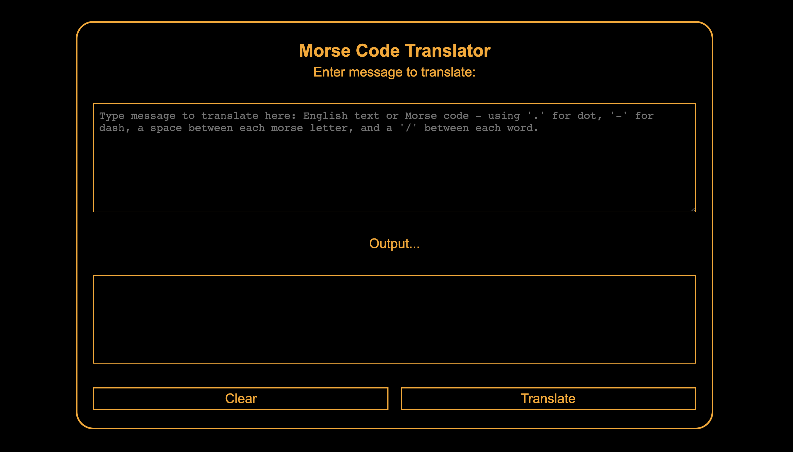

# Morse Code Translator

## Description

A simple web app using HTML, SCSS and Javascript to translate English to Morse Code or Morse Code to English.

You can test the app here:

https://kris-martin.github.io/morse-translator/



## Features

-   Detects if input is English or Morse and then translates and outputs result
-   Detects if input is valid Morse or uses invalid characters
-   Shows user error messages if empty input or invalid characters

## Project Brief

Create a web page Morse Code translator. The User Interface should be simple.

### MVP

-   Create a user interface that allows the user to either input some English text or some Morse Code
-   Create JS functions that would allow the user to:

    -   translate their English text into Morse Code
    -   Morse Code into English text

-   Make sure to handle spaces properly (ie. there is 1 space between English words, but one space between Morse Code characters)
-   Make sure to keep your pure functions separated from the JS DOM interaction code.

```js
// A to Z in Morse Code
{
   "A": ".-",
   "B": "-...",
   "C": "-.-.",
   "D": "-..",
   "E": ".",
   "F": "..-.",
   "G": "--.",
   "H": "....",
   "I": "..",
   "J": ".---",
   "K": "-.-",
   "L": ".-..",
   "M": "--",
   "N": "-.",
   "O": "---",
   "P": ".--.",
   "Q": "--.-",
   "R": ".-.",
   "S": "...",
   "T": "-",
   "U": "..-",
   "V": "...-",
   "W": ".--",
   "X": "-..-",
   "Y": "-.--",
   "Z": "--.."
   // Add space handling
   // " ": "/"
}

```
